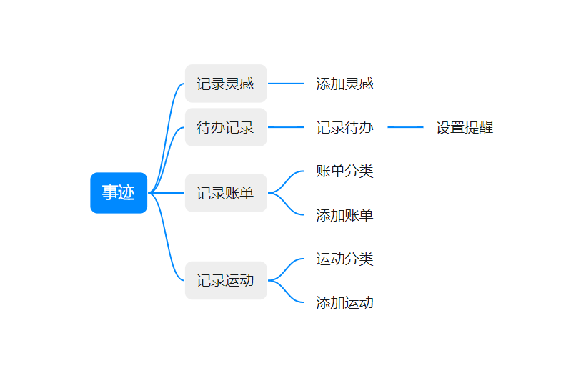
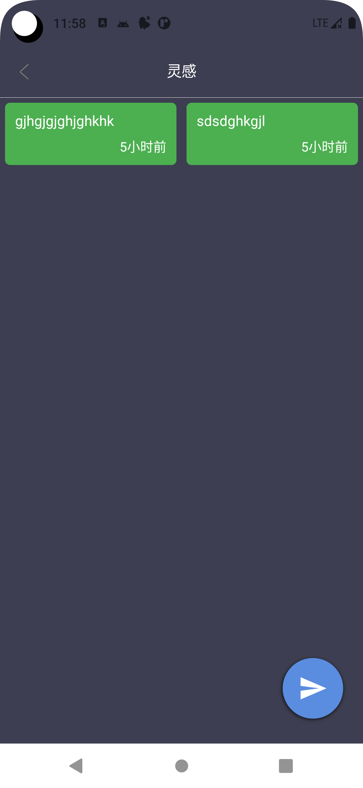
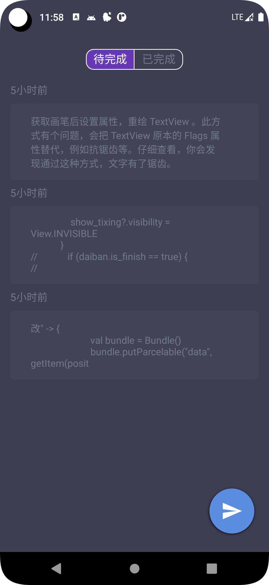
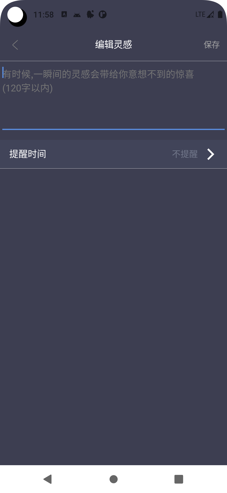
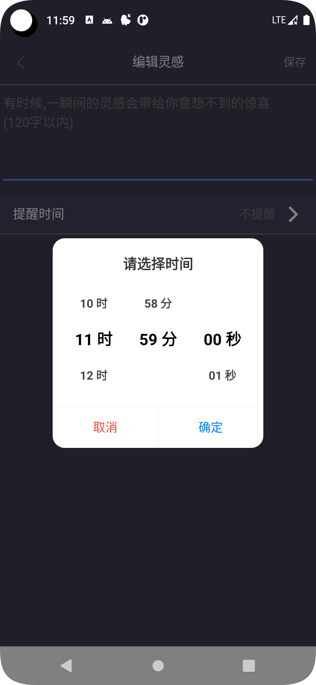

# 事迹
事迹,记录每一件事

    
    
    

下载地址

[comment]: <> (![ic_launcher-playstore.png]&#40;app/src/main/ic_launcher-playstore.png&#41;)

## 简介

这是一个记录生活中的每一件事的开源项目,为了开发一款简介,方便,高效的记录APP,没有付费功能,没有信息搜集,任何人都可以参与进来,一起维护它.
如果您有其他比较有意思的想法或项目,我们也可以一起来实现它.

我也是个萌新程序员,项目有什么地方不足,请多多指教,哈哈

## 功能计划

1. - [x] 灵感
2. - [x] 待办
3. - [ ] 记录账单
4. - [ ] 记录运动
5. ...
 
## 功能页面

|  |  |  |
|--|--|--|
|  |  |
|  |  |  |

## 涉及到的技能

1. Kotlin
2. [Room数据库](https://developer.android.google.cn/jetpack/androidx/releases/room)

## 参与人员(期待更多人的参与)

1. [clbDream](https://github.com/clbDream)

## 开源库链接

1. [AndroidProject-Kotlin](https://github.com/getActivity/AndroidProject-Kotlin)
